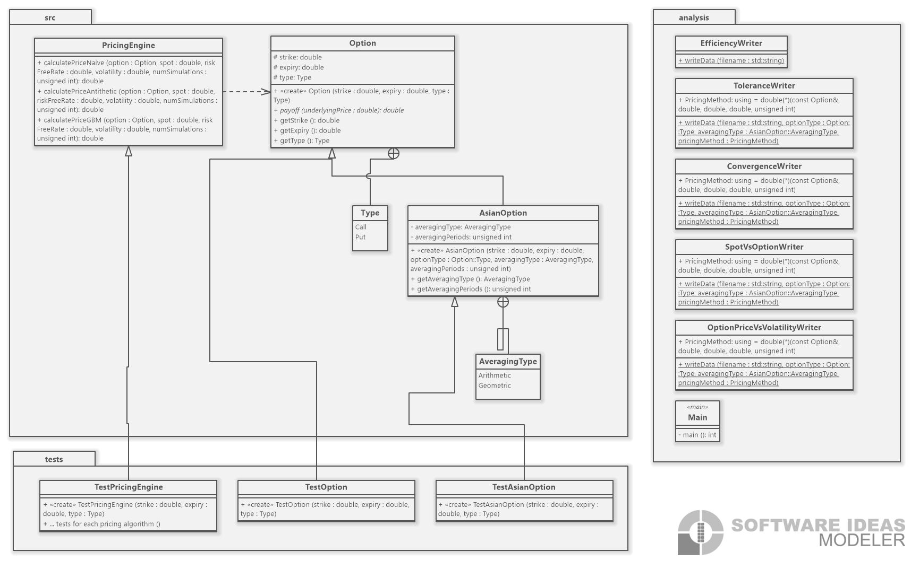

# IB9JHO - Programming for Quantitative Finance - Group Project (C++)

***
## Introduction
Pricing fixed strike Asian options using a variety of numerical option pricing methodologies. A suite of testing and analysis will then be performed, with a particular focus on computational complexity, accuracy in terms of comparison to analytical solutions and variance, as well as the standard testing of edge cases. The codebase is structured into separate header and source files to ensure modularity, extensibility, and maintainability.

We began with implementing the naïve method, followed by more complex methodologies such as antithetic variance reduction and a Geometric Brownian Motion technique. The idea is to design a clear class structure so that we can focus on the quality of the object-oriented implementation by following the principles taught in the module.

This project concludes with a written report, reviewing existing literature and discussing how it relates to published work. Methodologies will be discussed, including the reasons as to why certain steps were taken when designing our class structure. We will also discuss some potential limitations of our class structure, and any scope for future extensions.

We have taken steps to ensure good coding practices were followed, which includes but is not limited to:

1. Planning each function and data member in each class before writing any code. This helped minimise the amount of time spent reformatting the classes due to design issues.
2. Testing classes individually before integrating them into the project. This made the debugging process significantly more simple and faster.
3. Each group member performed work on separate branches. A pull request was created where other members reviewed their work before being merged with the `main` branch.


***
# Instructions to Run the Project

This project is comprised of a main application, a set of tests, and an analysis tool. To get started, you will need a machine with a C++ compiler and CMake version 3.14 or later installed. The following steps will guide you on how to build and run the different parts of the project.

## Building the Project

1. Open a terminal and navigate to the root directory of the project where the main `CMakeLists.txt` file is located.

2. Create a build directory and navigate into it. This will keep all the build files in a separate location and keep your source directory clean:


```
mkdir build
cd build
```

3. Run CMake to generate the build files:

```
cmake ..
```

4. Compile the project:

```
make
```

This will generate executables for the main application (`IB9JHO_Group_Project`), the tests (`OptionTests`, `AsianOptionTests`, `PricingEngineTests`), and the analysis tool (`Analysis`) in their respective directories within the `build` directory.

## Running the Main Application

To run the main application, navigate to the build directory for the main application (`build/src`) and run the following command:

```
./IB9JHO_Group_Project
```

## Running the Tests

To run the tests, navigate to the build directory for the tests (`build/tests`) and run the following commands:


```
./OptionTests
./AsianOptionTests
./PricingEngineTests
```


Each command will run the respective test suite.

## Running the Analysis Tool

To run the analysis tool, navigate to the build directory for the analysis tool (`build/analysis`) and run the following command:

```
./Analysis
```


This will output a CSV file with the results of the analysis in the `analysis` directory located in the root of the project.


***

## Implementation

The UML below briefly outlines the design of our codebase.



Option.hpp and Option.cpp define a base class called `Option`, that represents a generic financial option. The base class includes a constructor for initializing the option parameters (strike price, expiry, and option type), as well as a pure virtual function called `payoff()` for computing the option's payoff at expiration. The class also contains accessor methods to retrieve the values of the strike, expiry, and option type.

AsianOption.hpp and AsianOption.cpp define a derived class called `AsianOption`, which inherits from the `Option` base class. The `AsianOption` class represents an Asian option, a type of financial option whose payoff depends on the average price of the underlying asset over a certain period. The constructor initializes specific parameters for an Asian option, such as averaging type (arithmetic or geometric) and the number of averaging periods. The `payoff()` function is overridden in this class to provide the Asian option-specific formula for calculating the payoff at expiration. Additionally, this class includes accessor methods for retrieving the averaging type and number of averaging periods.

PricingEngine.hpp and PricingEngine.cpp define a `PricingEngine` class that prices options using numerical methods like Monte Carlo simulations. The class contains a constructor for initializing the engine's parameters such as the number of simulations, spot price, risk-free rate, volatility, and expiry time. It also includes a `price()` method that takes an option object as input and computes the price using Monte Carlo simulations. This method relies on the virtual `payoff()` function defined in the `Option` base class to calculate the payoff for the specific option type.

main.cpp is the driver program that initializes an AsianOption object with the desired parameters, passes it to the PricingEngine instance, and outputs the calculated price.

The code follows object-oriented programming best practices, such as encapsulation, inheritance, and polymorphism. It is also well-documented and adheres to good coding standards and practices for readability and maintainability.

***
UPDATE: 12/05/23
***
# Project Structure and Testing Documentation
## Project Structure
The project has been updated to use a more modular directory structure. It now includes separate directories for source files (src), header files (include), and unit tests (tests).

The src directory contains the implementation files for the project. Each of these files has a .cpp extension.
The include directory contains the header files, which declare the classes and functions that are defined in the corresponding .cpp files. Each of these files has a .hpp extension.
The tests directory contains the Google Test unit test files. Each of these files has a .cpp extension and contains a series of tests for the corresponding file in the src directory.
The project uses CMake as its build system. The top-level CMakeLists.txt file in the project root directory coordinates the build, specifying the project name, the required C++ standard, and the directories that should be included in the build.

## Unit Testing with Google Test
The project uses the Google Test framework for unit testing. Google Test provides a series of macros that allow you to easily define tests and test cases, and includes features for test discovery, running the tests, and reporting the results.

Each unit test file in the tests directory corresponds to a source file in the src directory. It includes a series of tests that verify the correctness of the functions and classes defined in that source file.

To run the tests, build the project (e.g. by running `cmake --build` from the command line in the build directory), and then execute the resulting test executable. This will run all the tests and report the results.

## Conclusion
This new project structure and testing framework makes the codebase more maintainable and robust. It is now easier to locate specific files, and the inclusion of unit tests will help to ensure the ongoing correctness of the code as it evolves over time.

***
UPDATE: 14/05/23
UPDATE: 16/05/23
***
# Unit Testing with GoogleTest Framework

Before writing the tests, the CMakeLists.txt file needs to be updated so that the tests themselves are linked the classes and functions that they are testing. These modifications are reflected in the minor updated to tests/CmakeLists.txt.

There are three files, each of which test the `Option`, `AsianOption` and `PricingEngine` classes separately. Each file follows OOP practices with the following class structure setup: 

1. SetUp(): This isn't a test per se, but it's important for the tests. This function is executed before each test is run. It sets up necessary objects and variables that the tests will use.
2. TearDown(): This function is executed after each test is run. It is used to clean up any resources that were used in the test.

## `test_option.cpp`

([Pull request #4](https://github.com/Buzzpod/IB9JHO_Group_Project/pull/4)) - Initial tests

This file tests the `Option` class, ensuring the accessor functions work as they should, returning the correct member variables. The tests are as follows:

1. TestGetStrike: Test case to ensure the strike price returned is correct.
2. TestGetExpiry: Test case to ensure the expiry time returned is correct.
3. TestGetType: Test case to ensure the type of option returned is correct. Can take two values - call or put.

## `test_asian_option.cpp`

([Pull request #5](https://github.com/Buzzpod/IB9JHO_Group_Project/pull/5)) - Initial tests

This file tests the `AsianOption` class, ensuring the accessor functions work as they should, returning the correct member variables. Since the `AsianOption` class inherits from the base `Option` class, we also check that the inherited accessor functions work as they should. The tests are as follows:

1. TestGetAveragingType: Test case to ensure the averaging type returned is correct. Can take two values - arithmetic or geometric.
2. TestGetAveragingPeriods: Test case to ensure the averaging periods returned is correct.
3. TestGetStrike: Test case to ensure the strike price returned is correct. Inherited from base class.
4. TestGetExpiry: Test case to ensure the expiry time returned is correct. Inherited from base class.
5. TestGetType: Test case to ensure the type of option returned is correct. Inherited from base class. Can take two values - call or put.

## `test_pricing_engine.cpp`

([Pull request #2](https://github.com/Buzzpod/IB9JHO_Group_Project/pull/2)) - Initial tests
([Pull request #6](https://github.com/Buzzpod/IB9JHO_Group_Project/pull/6)) - Added tests for GBM approximation
([Pull request #12](https://github.com/Buzzpod/IB9JHO_Group_Project/pull/12)) - Reduced number of assertions for tests and renamed test cases

This file tests the `PricingEngine` class, ensuring the prices returned are correct, whilst also looking at edge cases to see if the codebase performs unexpectedly. The tests are as follows:

1. TestNaiveCallGreaterZero: Test case to ensure the `calculatePriceNaive` function from the `PricingEngine` class is working correctly for call options. Specifically checks whether price is greater than zero.
2. TestNaivePutGreaterZero: Test case to ensure the `calculatePriceNaive` function from the `PricingEngine` class is working correctly for put options. Specifically checks whether price is greater than zero.
3. TestAntitheticCallGreaterZero: Test case to ensure the `calculatePriceAntithetic` function from the `PricingEngine` class is working correctly for call options. Specifically checks whether price is greater than zero.
4. TestAntitheticPutGreaterZero: Test case to ensure the `calculatePriceAntithetic` function from the `PricingEngine` class is working correctly for put options. Specifically checks whether price is greater than zero.
5. TestGBMCallGreaterZero: Test case to ensure the `calculatePriceGBM` function from the `PricingEngine` class is working correctly for call options. Specifically checks whether price is greater than zero.
6. TestGBMPutGreaterZero: Test case to ensure the `calculatePriceGBM` function from the `PricingEngine` class is working correctly for put options. Specifically checks whether price is greater than zero.
7. TestNaiveCallPriceNear: Test case to ensure that the naive method returns price close to the GBM approximation for call options. This has been performed for both averaging types.
8. TestAntitheticCallPriceNear: Test case to ensure that the antithetic method returns price close to the GBM approximation for call options. This has been performed for both averaging types.
9. TestNaivePutPriceNear: Test case to ensure that the naive method returns price close to the GBM approximation for put options. This has been performed for both averaging types.
10. TestAntitheticPutPriceNear: Test case to ensure that the antithetic method returns price close to the GBM approximation for put options. This has been performed for both averaging types.
11. TestNaiveCallEdgeCaseSpot: Edge case test, ensuring the naive method returns a price of zero for call options when spot_price=0.1 across both averaging types.
12. TestAntitheticCallEdgeCaseSpot: Edge case test, ensuring the antithetic method returns a price of zero for call options when spot_price=0.1 across both averaging types.
13. TestGBMCallEdgeCaseSpot: Edge case test, ensuring the GBM method returns a price of zero for call options when spot_price=0.1 across both averaging types.
14. TestNaiveCallEdgeCaseExpiry: Edge case test, ensuring the naive method returns a price of zero for call options when expiry time is imminent (0.01) across both averaging types (to 5dp).
15. TestAntitheticCallEdgeCaseExpiry: Edge case test, ensuring the antithetic method returns a price of zero for call options when expiry time is imminent (0.01) across both averaging types (to 5dp).
16. TestGBMCallEdgeCaseExpiry: Edge case test, ensuring the GBM method returns a price of zero for call options when expiry time is imminent (0.01) across both averaging types (to 5dp).

These tests are basic sanity checks. They help to ensure that the pricing functions from the `PricingEngine` class do not produce completely unreasonable results (like negative prices). However, they don't check whether the pricing functions are actually calculating the correct option prices. For that, you would need to compare the calculated prices to some known correct values, for example, by calculating an analytical solution or comparing to the prices generated by another source such as an online Asian option calculator. In this case, we have used the GBM approximation as a "true" price.

***
UPDATE: 14/05/23 (2)
UPDATE: 16/05/23
***
# Analysis code

All analysis takes place in the new sub-directory `analysis`. Some minor restructuring to the repository has been performed which now builds "src" as a library which is then linked to from "analysis" and "tests". This change in build structure became sense as the project expands to contain an increasing number of sub-modules that all rely on the classes and methods contained within "src". These changes are reflected in the updates CMakeLists.txt, src/CMakeLists.txt, analysis/CMakeLists.txt and tests/CMakeLists.txt.

Since it is both difficult and breaks "best practice" to directly generate graphs in c++, the `analysis` module has been constructed in such a way that outputs separate raw data files for each piece of analysis in csv format. These files have then been read into a jupyter notebook to generate visualisations.

A brief explanation of what the `Analysis.cpp` file is doing is provided:

1. Setting up the parameters: This includes the parameters for the Asian option (strike price, expiry time, option type, averaging type, and number of averaging periods), the parameters for the pricing calculation (spot price, risk-free rate, volatility), and the number of simulations for the Monte Carlo methods.

2. Creating an Asian option object: This object represents the option that we are pricing. We create two objects, one for a call option and one for a put option.

3. Calculating the price of the option: We use the Monte Carlo methods implemented in the PricingEngine class to calculate the price of the option. We calculate the price for both the call and put options, using both the naive and antithetic methods.

4. Writing the prices to a CSV file: Finally, we write the prices calculated for the different options and methods to a CSV file. This file can be used for further analysis, such as in Excel

***
UPDATE: 15/05/23 
***
# GBM Approximation code 
([Pull request #3](https://github.com/Buzzpod/IB9JHO_Group_Project/pull/3))

Added code for the GBM approximation of the price of the option to PricingEngine.hpp and PricingEngine.cpp which calculates the option price by constantly updating the spot price using a Geometric Brownian Motion. This can be used as a proxy to the analytical price of the option.

***
UPDATE: 21/05/23 
***
Classes:
All classes use the static function writeData to generate a CSV file in the same directory and write the data in it. 
1. SpotVsOptionWriter: loops over a range of spot prices and generates the corresponding option price for different expiry times using the GBM approximation
2. ConvergenceWriter: loops over a range of number of simulations and generates the corresponding option prices of the three methods for constant parameters
3. OptionPriceVsVolatilityWriter: loops over a range of volatility values and generates the corresponding option price for different expiry times using the GBM approximation
4. EfficiencyWriter: loops over a range of number of simulations and and calculates the computational time of the two methods, naive and antithetic, for constant parameters
5. ToleranceWriter: loops over a range of number of simulations and calculates the difference between the option price of each of the two methods and the GBM approximation for constant parameters
